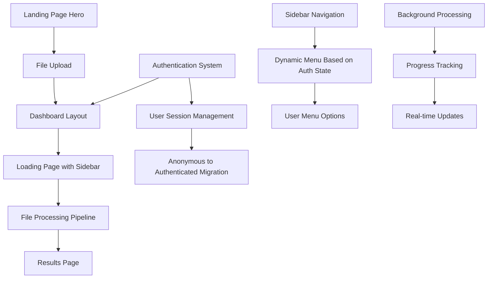

# Design Document

## Overview

This design document outlines the comprehensive enhancement of the TestNG XML file upload experience, transforming it from a simple upload flow into a full-featured dashboard application. The design focuses on creating a professional user interface with collapsible sidebar navigation, enhanced loading states with detailed progress tracking, seamless authentication integration, and optimized file processing for large files.

The solution leverages the existing tech stack (Next.js 15, Tailwind CSS v4, Shadcn UI, Better-Auth, Neon DB, Prisma, Pino logger) while introducing new architectural patterns for improved user experience and performance.

## Architecture

### High-Level Architecture



### Component Architecture

The design introduces several new components and modifies existing ones:

1. **Enhanced Dashboard Layout** - New layout wrapper with sidebar integration
2. **Dynamic Sidebar Component** - Context-aware navigation based on authentication state
3. **Enhanced Loading Component** - Detailed progress tracking with step-by-step visualization
4. **Authentication Integration Layer** - Seamless user session management
5. **Background Processing Service** - Optimized file processing with progress tracking

## Layout Consistency Strategy

### Unified Dashboard Experience

To ensure a seamless user experience, all processing and results pages will use a consistent dashboard layout:

1. **Loading Page Layout**: Uses dashboard layout with sidebar navigation, replacing the previous standalone card-based design
2. **Results Page Layout**: Integrates with dashboard layout instead of using standalone NavBar component
3. **Sequential Step Processing**: Processing steps complete in proper order without overlapping or out-of-sequence completion
4. **Breadcrumb Navigation**: Consistent breadcrumb navigation showing current location within the dashboard

### Layout Hierarchy

```
Dashboard Layout
├── Sidebar Navigation (collapsible)
├── Header with Breadcrumbs
└── Main Content Area
    ├── Loading Page (during processing)
    └── Results Page (after completion)
```

### Layout Components

- **Common Layout**: `apps/web/app/(app)/dashboard/layout.tsx` - Base dashboard layout
- **Loading Layout**: `apps/web/app/(app)/loading/layout.tsx` - Wrapper for loading page
- **Results Layout**: `apps/web/app/(app)/results/layout.tsx` - Wrapper for results page

## Components and Interfaces

### 1. Dashboard Layout Component

**Location**: `apps/web/app/(app)/dashboard/layout.tsx`

**Purpose**: Provides the main dashboard layout with collapsible sidebar for all authenticated/processing pages.

**Key Features**:
- Collapsible sidebar integration using Shadcn UI Sidebar component
- Responsive design for mobile and desktop
- Authentication state awareness
- Consistent layout across dashboard pages

**Interface**:
```typescript
interface DashboardLayoutProps {
  children: React.ReactNode;
}

interface SidebarState {
  isCollapsed: boolean;
  toggleCollapse: () => void;
}
```

### 2. Enhanced Sidebar Component

**Location**: `packages/ui/src/components/enhanced-app-sidebar.tsx`

**Purpose**: Dynamic sidebar navigation that adapts based on user authentication state.

**Key Features**:
- Dynamic menu items based on authentication status
- User profile section with avatar and details
- Sign in/out functionality
- Collapsible design with icon-only mode

**Interface**:
```typescript
interface EnhancedSidebarProps {
  user?: {
    id: string;
    name: string;
    email: string;
    avatar?: string;
    isAnonymous: boolean;
  };
  onAuthAction: (action: 'signin' | 'signout' | 'signup') => void;
}

interface MenuItem {
  title: string;
  url: string;
  icon: React.ComponentType;
  isActive?: boolean;
  requiresAuth?: boolean;
}
```

### 3. Enhanced Loading Component

**Location**: `apps/web/app/(app)/loading/page.tsx` (modified)

**Purpose**: Provides detailed progress tracking with step-by-step visualization of file processing.

**Key Features**:
- Step-by-step progress visualization with status icons
- Real-time status updates
- Error handling with user-friendly messages
- Failed step handling with remaining steps marked as skipped
- Visual status indicators: green check (success), red cross (failed), clock (pending), grayed clock (skipped)
- Integration with dashboard layout

**Interface**:
```typescript
interface ProcessingStep {
  id: string;
  title: string;
  status: 'pending' | 'processing' | 'completed' | 'error' | 'skipped';
  progress: number;
  icon: 'check' | 'cross' | 'clock' | 'spinner';
  iconColor: 'green' | 'red' | 'gray' | 'blue';
}

interface LoadingPageProps {
  reportId: string;
  onComplete: (reportData: any) => void;
  onError: (error: string) => void;
}
```

### 4. Authentication Integration Service

**Location**: `packages/auth/src/lib/auth-integration.ts`

**Purpose**: Manages seamless authentication state transitions and user session handling.

**Key Features**:
- Anonymous to authenticated user migration
- Session state management
- Report ownership transfer
- Authentication state persistence

**Interface**:
```typescript
interface AuthIntegrationService {
  getCurrentUser(): Promise<User | null>;
  migrateAnonymousUser(newUser: User): Promise<void>;
  checkAuthRequirement(action: string): boolean;
  redirectToAuth(returnUrl: string): void;
}

interface User {
  id: string;
  name: string;
  email: string;
  avatar?: string;
  isAnonymous: boolean;
}
```

### 5. Background Processing Service

**Location**: `apps/web/lib/processing-service.ts`

**Purpose**: Handles file processing with progress tracking and performance optimization.

**Key Features**:
- Chunked processing for large files
- Progress tracking and reporting
- Error handling and recovery
- Performance monitoring

**Interface**:
```typescript
interface ProcessingService {
  processFile(fileId: string, xmlContent: string): Promise<ProcessingResult>;
  getProcessingStatus(fileId: string): Promise<ProcessingStatus>;
  cancelProcessing(fileId: string): Promise<void>;
}

interface ProcessingResult {
  success: boolean;
  data?: any;
  error?: string;
  processingTime: number;
}

interface ProcessingStatus {
  currentStep: ProcessingStep;
  overallProgress: number;
  estimatedTimeRemaining: number;
}
```

## Data Models

### Enhanced TestReport Model

The existing TestReport model will be extended to support the new features:

```prisma
model TestReport {
  id            String   @id @default(cuid())
  userId        String
  fileName      String
  xmlContent    String
  jsonData      String
  status        ReportStatus
  errorMessage  String?
  processingSteps ProcessingStep[]
  createdAt     DateTime @default(now())
  updatedAt     DateTime @updatedAt
  
  user          User     @relation(fields: [userId], references: [id])
}

model ProcessingStep {
  id          String   @id @default(cuid())
  reportId    String
  stepName    String
  status      StepStatus
  startTime   DateTime?
  endTime     DateTime?
  progress    Int      @default(0)
  errorMessage String?
  
  report      TestReport @relation(fields: [reportId], references: [id])
}

enum ReportStatus {
  PENDING
  PROCESSING
  COMPLETED
  FAILED
}

enum StepStatus {
  PENDING
  PROCESSING
  COMPLETED
  FAILED
  SKIPPED
}
```

### User Session Enhancement

Extend the existing user model to better support anonymous users:

```prisma
model User {
  id          String   @id @default(cuid())
  name        String?
  email       String?  @unique
  avatar      String?
  isAnonymous Boolean  @default(false)
  createdAt   DateTime @default(now())
  updatedAt   DateTime @updatedAt
  
  testReports TestReport[]
  loginDetails LoginDetails[]
}
```

## Step Status Management

### Visual Status Indicators

The loading page implements a comprehensive visual feedback system for processing steps:

1. **Completed Steps**: Green check icon (✓) with normal text color
2. **Failed Steps**: Red cross icon (✗) with error text color
3. **Pending Steps**: Clock icon with normal text color
4. **Skipped Steps**: Grayed clock icon with muted text color

### Step Failure Handling

When a processing step fails:
1. The failed step is marked with a red cross icon
2. All remaining unprocessed steps are automatically marked as "skipped"
3. Skipped steps display with grayed-out clock icons and muted text
4. The overall process is marked as failed
5. User is presented with error recovery options

### Step Processing Logic

```typescript
interface StepProcessor {
  processStep(step: ProcessingStep): Promise<StepResult>;
  handleStepFailure(failedStep: ProcessingStep, remainingSteps: ProcessingStep[]): void;
  updateStepStatus(stepId: string, status: StepStatus, icon: StepIcon): void;
}

interface StepIcon {
  type: 'check' | 'cross' | 'clock' | 'spinner';
  color: 'green' | 'red' | 'gray' | 'blue';
  className: string;
}
```

## Error Handling

### Error Categories

1. **File Upload Errors**
   - Invalid file format
   - File size exceeded
   - Network connectivity issues
   - Server unavailability

2. **Processing Errors**
   - XML parsing failures
   - Data conversion errors
   - Database connection issues
   - Memory limitations

3. **Authentication Errors**
   - Session expiration
   - Authentication provider failures
   - User migration errors

### Error Handling Strategy

```typescript
interface ErrorHandler {
  handleUploadError(error: UploadError): ErrorResponse;
  handleProcessingError(error: ProcessingError): ErrorResponse;
  handleAuthError(error: AuthError): ErrorResponse;
}

interface ErrorResponse {
  userMessage: string;
  technicalMessage: string;
  recoveryActions: RecoveryAction[];
  shouldRetry: boolean;
}

interface RecoveryAction {
  label: string;
  action: () => void;
  isPrimary: boolean;
}
```

### Error UI Components

- **Error Boundary**: Catches and displays React component errors
- **Toast Notifications**: For non-critical errors and status updates
- **Error Cards**: For critical errors requiring user action
- **Retry Mechanisms**: Automatic and manual retry options

## Testing Strategy

### Unit Testing

1. **Component Testing**
   - Sidebar component with different authentication states
   - Loading component with various processing states
   - File upload component with error scenarios
   - Authentication integration service

2. **Service Testing**
   - Background processing service
   - Authentication state management
   - Error handling mechanisms
   - Progress tracking accuracy

### Integration Testing

1. **Authentication Flow Testing**
   - Anonymous user creation
   - User authentication and migration
   - Session persistence
   - Report ownership transfer

2. **File Processing Testing**
   - End-to-end upload and processing flow
   - Large file handling
   - Error recovery scenarios
   - Progress tracking accuracy

3. **UI Integration Testing**
   - Dashboard layout responsiveness
   - Sidebar state management
   - Loading state transitions
   - Error state handling

### Performance Testing

1. **File Processing Performance**
   - Large file processing times
   - Memory usage monitoring
   - Concurrent processing handling
   - Database query optimization

2. **UI Performance**
   - Component rendering performance
   - State update efficiency
   - Animation smoothness
   - Mobile responsiveness

### End-to-End Testing

1. **User Journey Testing**
   - Complete upload flow from landing page to results
   - Authentication integration scenarios
   - Error recovery paths
   - Mobile and desktop experiences

2. **Cross-Browser Testing**
   - Modern browser compatibility
   - Mobile browser testing
   - Progressive enhancement validation

## Implementation Phases

### Phase 1: Dashboard Layout and Sidebar
- Create dashboard layout component
- Implement enhanced sidebar with authentication awareness
- Update routing structure for dashboard pages
- Basic authentication state integration

### Phase 2: Enhanced Loading Experience
- Redesign loading page with step-by-step progress
- Implement background processing service
- Add progress tracking to existing upload API
- Error handling improvements

### Phase 3: Authentication Integration
- Implement seamless authentication flow
- Add user migration functionality
- Update sidebar with dynamic menu options
- Session management enhancements

### Phase 4: Performance Optimization
- Large file handling improvements
- Background processing optimization
- UI performance enhancements
- Comprehensive error handling

### Phase 5: Testing and Polish
- Comprehensive testing implementation
- UI/UX refinements
- Performance monitoring
- Documentation updates

## Security Considerations

1. **File Upload Security**
   - File type validation
   - File size limits
   - Content scanning for malicious code
   - Secure file storage

2. **Authentication Security**
   - Secure session management
   - CSRF protection
   - Rate limiting for authentication attempts
   - Secure user data migration

3. **Data Protection**
   - Encrypted data storage
   - Secure API endpoints
   - User data privacy compliance
   - Audit logging for sensitive operations

## Performance Considerations

1. **File Processing Optimization**
   - Streaming XML parsing for large files
   - Chunked processing to prevent memory issues
   - Background job queuing for heavy processing
   - Progress tracking without performance impact

2. **UI Performance**
   - Lazy loading for dashboard components
   - Optimized re-rendering strategies
   - Efficient state management
   - Responsive design optimization

3. **Database Performance**
   - Optimized queries for report retrieval
   - Proper indexing for user and report relationships
   - Connection pooling for concurrent requests
   - Caching strategies for frequently accessed data